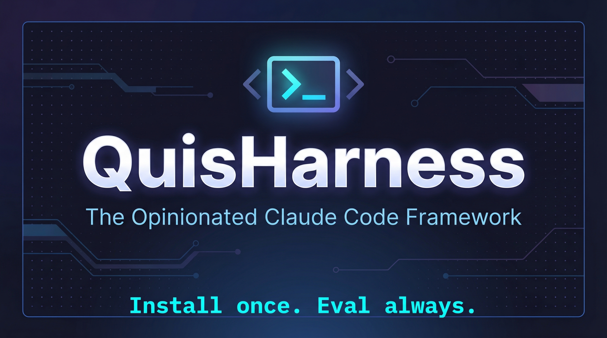

<p align="center">
  
</p>

<p align="center">
  <strong>The opinionated Claude Code framework — install once, eval always.</strong>
</p>

<p align="center">
  <a href="LICENSE"></a>
  <a href="https://github.com/deserteaglemjAEC/QuisHarness/releases"></a>
  <a href="https://github.com/deserteaglemjAEC/QuisHarness/stargazers"></a>
</p>



## Why QuisHarness?

Most Claude Code setups are copy-paste from blog posts — no structure, no evaluation, no way to know if your config is actually good. QuisHarness gives you a tested, opinionated foundation with a built-in eval system to prove it works.

- [Quick Start](#quick-start)
- [What You Get](#what-you-get)
- [Eval Your Setup](#eval-your-setup)
- [How to Evaluate Plugins](#how-to-evaluate-plugins)
- [Hook Architecture](#hook-architecture)
- [FAQ](#faq)

## What You Get

| Benefit | Details |
|---------|---------|
| **30-second install** | One command sets up rules, hooks, skills, and templates |
| **Built-in eval system** | Score your setup against 15+ assertions |
| **Plugin evaluation** | Test any community plugin before trusting it |
| **Battle-tested defaults** | 9 rules, 2 hook patterns, 3 skill examples |
| **Safe and reversible** | Backups everything before touching your config |

## Before / After

```
BEFORE (default)                    AFTER (with QuisHarness)
~/.claude/                          ~/.claude/
├── CLAUDE.md (empty or bloated)    ├── CLAUDE.md (< 200 lines, focused)
├── settings.json                   ├── settings.json (hooks configured)
└── (nothing else)                  ├── keybindings.json
                                    ├── rules/common/ (9 rule files)
                                    ├── hooks/ (context injection, etc.)
                                    ├── scripts/ (eval + diagnostics)
                                    ├── skills/ (your custom skills)
                                    ├── output-styles/
                                    ├── agent-memory/
                                    └── warnings/
```

## Quick Start

```bash
git clone https://github.com/deserteaglemjAEC/QuisHarness.git
cd QuisHarness
bash install.sh
```

The installer backs up your existing files, copies the framework, and shows your eval score. Run `bash install.sh --dry-run` to preview without making changes.

**Post-install:** Review `templates/settings-example.json` and merge into your `~/.claude/settings.json`. Customize `hooks/memory-context.py` with your project directories and copy to `~/.claude/hooks/`.

## What's Included

| Component | Contents | Purpose |
|-----------|----------|---------|
| **templates/** | CLAUDE.md, settings example, keybindings | Optimized starting configuration |
| **rules/common/** | 9 rule files (coding, git, security, testing, etc.) | Global coding standards for every project |
| **scripts/** | 3 eval scripts + setup diagnostic | Score and improve your setup |
| **hooks/** | Memory context template + 2 examples | Hook architecture patterns |
| **skills/examples/** | 3 skill patterns (trigger, evolved, rich) | Best practices for writing skills |
| **output-styles/** | Brief output style | Response formatting preset |
| **docs/** | 9 deep-dive documents | Architecture, mental model, hooks, evals, plugins |

## Eval Your Setup

QuisHarness includes three evaluation scripts:

```bash
# Directory structure score (25 points)
bash ~/.claude/scripts/eval-claude-directory.sh

# Skill description quality (per-skill scoring)
bash ~/.claude/scripts/eval-skill-activation.sh

# Everything combined (percentage)
bash ~/.claude/scripts/eval-composite.sh
```

A fresh install scores ~17-19/25 on the directory eval. The remaining points come from adding skills (via plugins) and configuring hooks. See [Eval Guide](docs/eval-guide.md) for details.

## How to Evaluate Plugins

QuisHarness is plugin-agnostic — it teaches you how to evaluate plugins rather than recommending specific ones. The 5 criteria:

1. **Activation Noise** — Does it fire on irrelevant prompts?
2. **Context Cost** — How much context window does it consume?
3. **Overlap Detection** — Does it duplicate another plugin?
4. **Update Frequency** — Is it actively maintained?
5. **Permission Scope** — What tools does it need?

Sweet spot: **10-25 plugins**. Read the full [Plugin Evaluation Framework](docs/plugin-evaluation.md).

## Hook Architecture

| Hook Type | When It Fires | Example Use |
|-----------|--------------|-------------|
| SessionStart | Session begins/resumes | Inject project context |
| PreToolUse | Before a tool runs | Block dangerous commands |
| PostToolUse | After a tool completes | Auto-format code |
| UserPromptSubmit | User sends a message | Classify prompts |

See [Hook Patterns](docs/hook-patterns.md) for skeleton code and configuration examples.

## Prerequisites

- **Claude Code CLI** installed ([claude.ai/code](https://claude.ai/code))
- **Bash 4+** — macOS users may need `brew install bash` (macOS ships 3.2)
- **Python 3** — for hook templates (standard library only, no pip)

<details>
<summary><strong>FAQ</strong></summary>

**Is this a plugin?**
No. QuisHarness is a framework — it installs templates, rules, and scripts to your `~/.claude/` directory. Plugins sit on top of this foundation.

**Does it require SuperMemory?**
No. The `memory-context.py` hook template shows a project-scoping pattern that works with any memory system.

**Will it overwrite my settings.json?**
No. The installer deliberately skips `settings.json`. Review `templates/settings-example.json` and merge manually.

**Why doesn't install.sh copy hooks?**
Hooks need customization for your specific projects. The templates in `hooks/` are starting points.

**How do I customize after installing?**
Edit `~/.claude/CLAUDE.md`, add rule files to `~/.claude/rules/`, customize hooks, run eval scripts to measure changes.

**What if I already have a configured setup?**
Run `bash install.sh --dry-run` first. The installer backs up existing files before overwriting.

</details>

## Contributing

See [CONTRIBUTING.md](CONTRIBUTING.md) for how to add rules, hook patterns, eval assertions, and documentation improvements.

## License

MIT - see [LICENSE](LICENSE)

---

<p align="center">
  <a href="https://star-history.com/#deserteaglemjAEC/QuisHarness&Date">
    
  </a>
</p>
