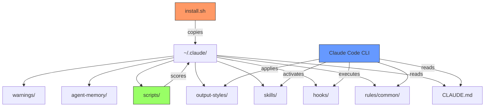
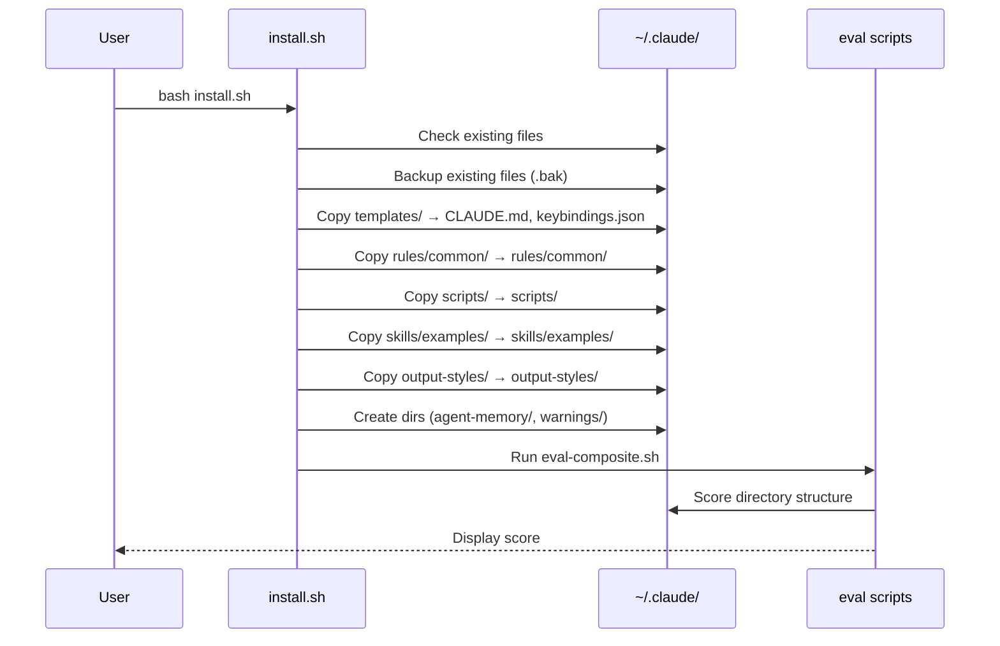
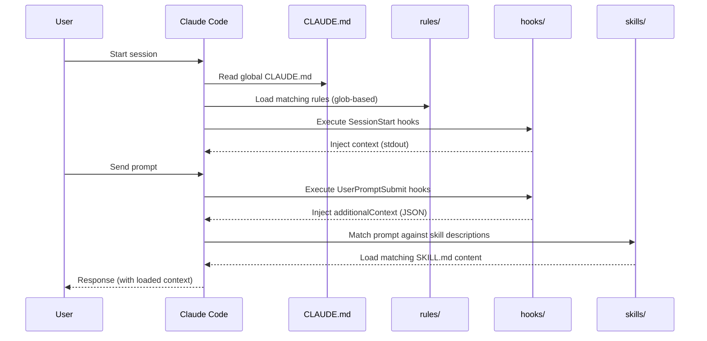
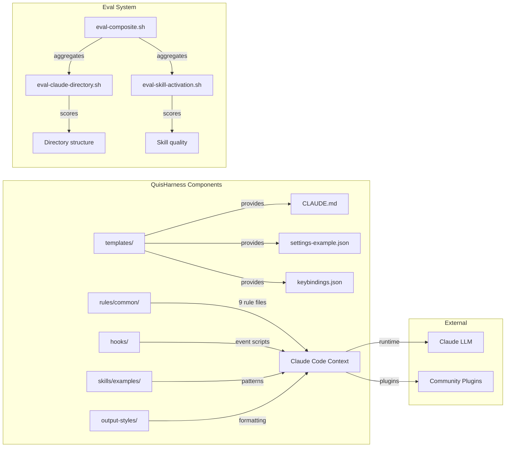

# System Architecture

## Overview

QuisHarness is a file-based framework — it installs files into `~/.claude/` that Claude Code reads at runtime. There is no server, no daemon, no build process.

## Component Relationship

## Data Flow: Installation

## Data Flow: Claude Code Session

## Component Dependencies

## Key Design Decisions

### Why file-based (not a plugin)?

Plugins add context at runtime. QuisHarness configures the **foundation** that plugins sit on — directory structure, rules, eval criteria. A plugin can't create your `rules/common/` directory or teach you to evaluate other plugins.

### Why eval scripts (not CI)?

Eval scripts run locally against `~/.claude/`. CI doesn't have access to the user's home directory. The eval system is designed for **personal measurement**, not automated enforcement.

### Why templates instead of auto-config?

`settings.json` and hooks are too personal to auto-configure. Wrong hook config breaks Claude Code entirely. Templates show the pattern; users adapt to their workflow.

### Why Bash + Python (not Node)?

Zero dependency principle. Every macOS/Linux system has Bash and Python 3. Node would require `npm install` — an unnecessary barrier for a tool that configures a CLI.
